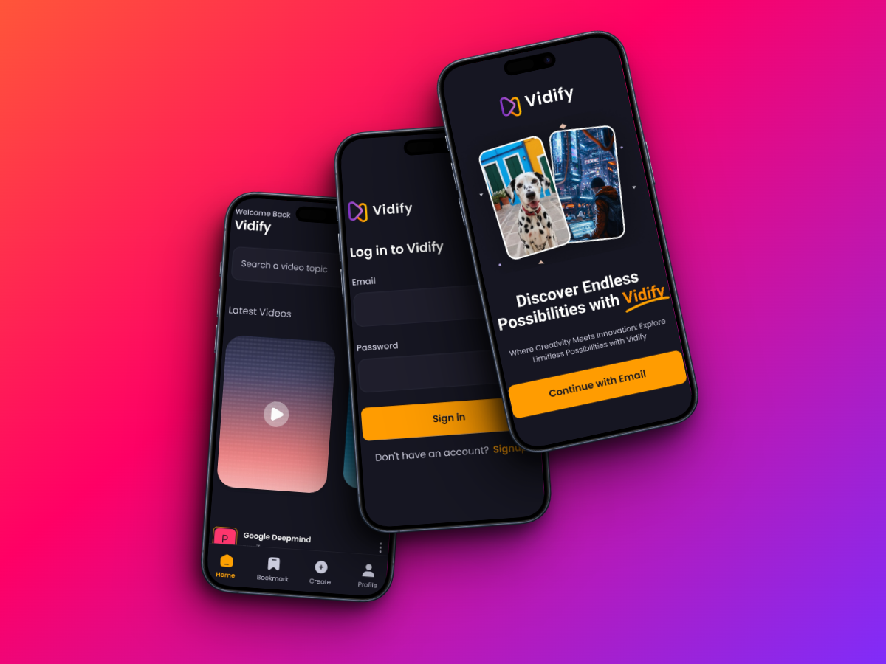

## <a name="introduction">🤖 Introduction</a>

Vidify, a cutting-edge app crafted with React Native, Expo, Expo Router, Nativewind, and powered by the robust backend of Appwrite. Vidify offers users a seamless experience with captivating Animatable animations and a sleek design. With its integration with Appwrite's dependable backend systems, Vidify enables effortless sharing of videos, fostering a vibrant community of creators.

## <a name="tech-stack">⚙️ Tech Stack</a>

- React Native
- Expo
- Nativewind
- Animatable
- Appwrite

## <a name="features">🔋 Features</a>

👉 **Onboarding Screen**: Attractive visuals and concise guidance greet users upon entering the app.

👉 **Robust Authentication & Authorization System**: Secure email logins protect user accounts.

👉 **Dynamic Home Screen with Animated Flat List**: Fluidly animated flat list displays the newest videos for effortless navigation.

👉 **Pull-to-Refresh Functionality**: Users can update content easily by pulling for the latest information.

👉 **Full-Text Search Capability**: Efficiently browse videos with live suggestions and immediate outcomes.

👉 **Tab Navigation**: Easily switch between Home, Search, and Profile sections using tab navigation.

👉 **Post Creation Screen for Uploading Media**: Upload video and image posts directly from the app with integrated media selection.

👉 **Profile Screen with Detailed Insights**: Explore account details and activity, such as uploaded videos and follower count, for a personalized user experience.

👉 **Animations**: Enhancing user interaction and engagement in the app's UI through dynamic animations using the Animatable library.

and many others, such as code structure and reusability 

## <a name="quick-start">🤸 Quick Start</a>

Follow these steps to set up the project on your local machine.

**Prerequisites**

Make sure you have the following installed on your machine:

- [Git](https://git-scm.com/)
- [Node.js](https://nodejs.org/en)
- [npm](https://www.npmjs.com/) (Node Package Manager)

**Cloning the Repository**

```bash
https://github.com/mohamed3samy/vidify.git
cd vidify
```
**Installation**

Install the project dependencies using npm:

```bash
npm install
```

**Add the API keys to .env file**

**Running the Project**

```bash
npm start
```

**Expo Go**

Download the [Expo Go](https://expo.dev/go) app onto your device, then use it to scan the QR code from Terminal and run.

